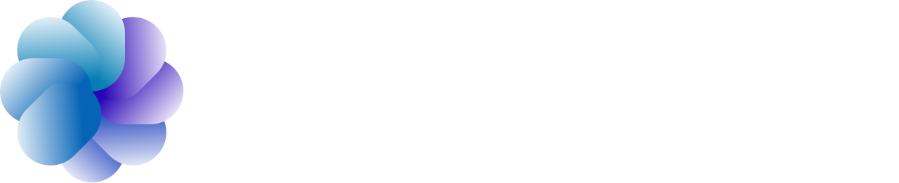
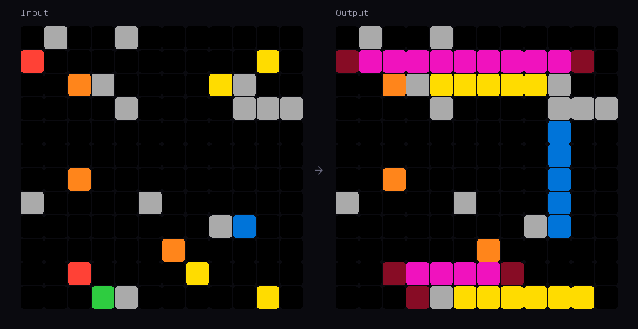
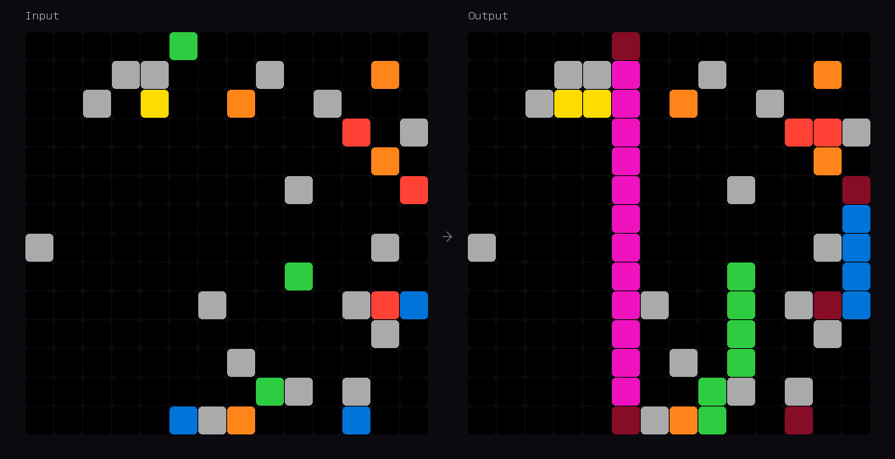
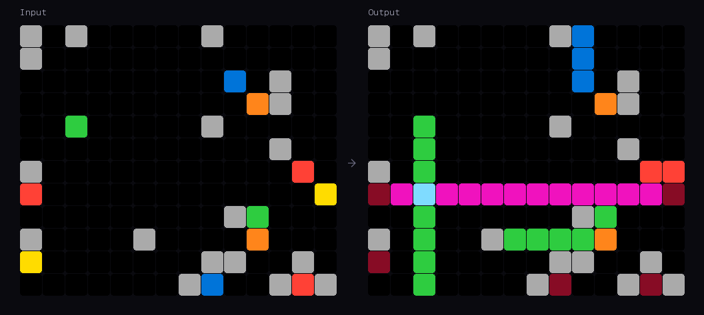

<p align="center">
  
</p>

# Held-Out Reasoning Eval Puzzles

Fresh reasoning evaluation puzzles in ARC-AGI format. Human-designed, human-verified, never published anywhere. If your model scores well on these, it earned it.

## Why this exists

Public benchmarks are leaking into training data — and it's already affecting scores. The ARC Prize 2025 technical report found that frontier models use [correct ARC color mappings in their reasoning without being told the format](https://arxiv.org/abs/2601.10904), which strongly suggests ARC data lives in their weights. ARC-AGI-1 is effectively saturated at 93%+. Even ARC-AGI-2 shows signs of knowledge-dependent overfitting.

[ARC Prize 2026](https://arcprize.org/competitions/2026) responds with ARC-AGI-3, an entirely new interactive format where the best AI currently hits 12.58% against a 100% human baseline. That's the state of things.

**These puzzles are held out.** They don't exist in any public dataset, any crawl, or any training corpus. Every task is designed from scratch by human experts and independently verified before release. No LLM was involved in creating them.

## What's in this repo

One sample puzzle and a drop-in browser viewer.

- `puzzles/signal_propagation.json` — spatial logic, 6 rules, 6 training pairs, 1 test pair, grids from 12×12 to 20×20
- `viewer/arc_puzzle_viewer.html` — open in any browser, load any ARC-format JSON to visualize input/output pairs

Standard ARC-AGI format. Grids are N×M integer matrices (0–9). Compatible with existing ARC tooling out of the box.

## Sample: Signal Propagation with Arithmetic Gates





Four emitter types fire beams in fixed directions (blue → up, red → right, green → down, yellow → left). Orange gates deflect beams 90° clockwise. When beams of different colors collide, they mix — magenta for 2 colors, azure for 3+. Emitters whose trail cells are fully overwritten get marked dead.

The puzzle requires applying all 6 rules in sequence across grids of increasing size. Full rule spec and color map are in the JSON.

## Format

```json
{
  "id": "ql-signal-propagation-001",
  "type": "spatial_logic",
  "difficulty": "medium",
  "rules": {
    "description": "...",
    "elements": { "0": "empty", "1": "blue — emitter, fires UP", "..." : "..." },
    "steps": [ "Rule 1 — Fire: ...", "Rule 2 — Propagation: ...", "..." ],
    "notes": [ "..." ]
  },
  "train": [
    { "input": [[0,1,...], ...], "output": [[0,5,...], ...] }
  ],
  "test": [
    { "input": [[...]], "output": [[...]] }
  ],
  "coverage": {
    "features_exercised": ["all_4_beam_directions", "gate_deflection", "..."]
  }
}
```

The `rules` and `coverage` fields are our additions to the standard ARC format — they document exactly what reasoning each puzzle tests and what each training pair covers. Strip them if you want vanilla ARC compatibility.

## How we build these

Each puzzle goes through a simple pipeline: a human expert designs the rule system and grids from scratch, a separate person solves it without seeing the intended answer to confirm it's unambiguous, and we validate that training pairs cover the full rule set. No generation shortcuts, no LLM assistance. That's what makes held-out data actually held-out.

## More puzzles

This is a sample from a larger library. We build evaluation tasks across several families:

- **Spatial logic** — directional mechanics, region filling, collision systems
- **Constraint propagation** — iterative inference across grid cells
- **Multi-step transformations** — sequential rule application, state machines
- **Pattern completion** — abstract visual pattern extension

Different difficulties, different grid sizes, custom volumes. We also build multilingual reasoning tasks across 25+ European languages for teams evaluating beyond English.

Custom eval sets available on request.

## License

CC BY-NC 4.0. Free for research and evaluation with attribution. Don't include these in training data — that's the whole point.

## Contact

**tag@quanta-labs.ai** · [quanta-labs.ai](https://quanta-labs.ai)

Ran your model on these? We'd love to hear how it did.

---

<p align="center">Built by <a href="https://quanta-labs.ai">Quanta Labs</a> · Munich, Germany</p>